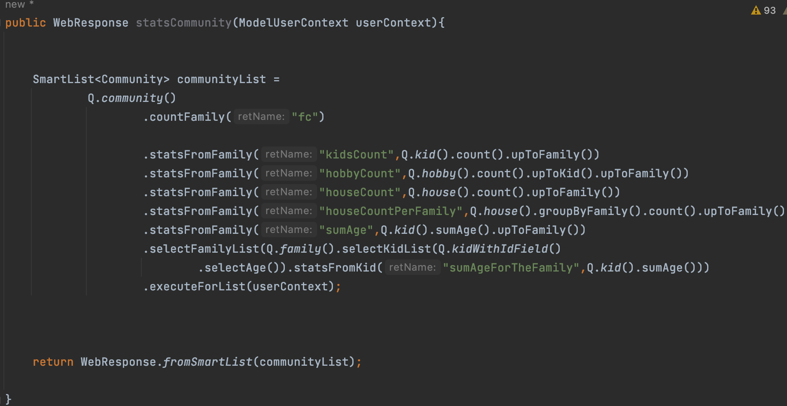
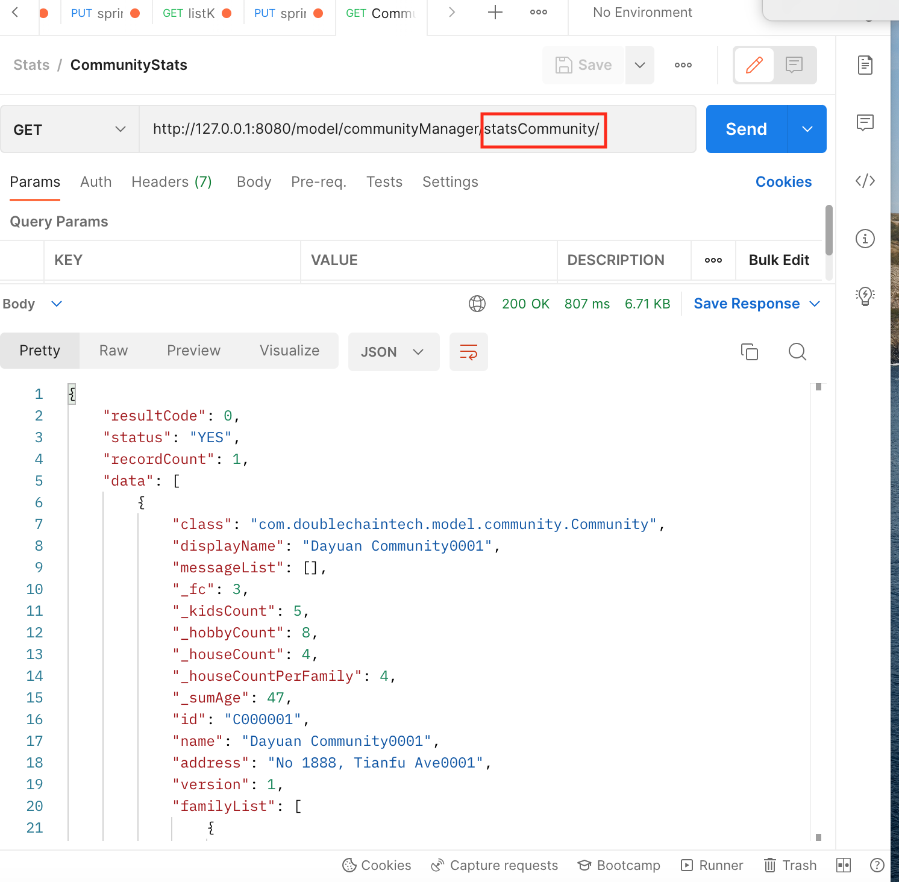
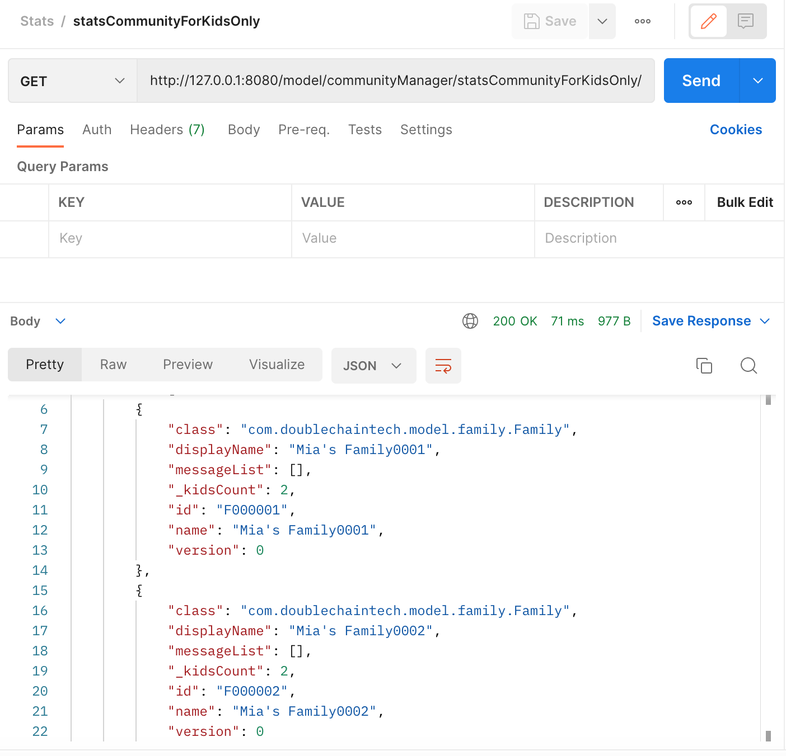

## STATS BY USING POSTMAN ##

If you want to count all the peaple in this community, or the population of a family, you can use IntelliJ IDEA and Postman to complete it.  
Follow these steps. 

1. Write a function in IntelliJ IDEA like this.  
     Multiple choice(e.g. I want to see all households, That is *from top to the bottom*). write a function in IntelliJ IDEA like this.  

>public WebResponse statsCommunity(ModelUserContext userContext){
>    
>    
>        SmartList<Community> communityList =
>                Q.community()
>                       .countFamily("fc")
>    
>                        .statsFromFamily("kidsCount",Q.kid()>.count().upToFamily())
>                        .statsFromFamily("hobbyCount",Q.hobby().count().upToKid().upToFamily())                      >.statsFromFamily("houseCount",Q.house().count().upToFamily())   >.statsFromFamily("houseCountPerFamily",Q.house().groupByFamily().count().upToFami>ly())                       >.statsFromFamily("sumAge",Q.kid().sumAge().upToFamily())                       >.selectFamilyList(Q.family().selectKidList(Q.kidWithIdField()
>                               .selectAge()).statsFromKid("sumAgeForTheFamily",Q.kid().sumAge()))
>                        .executeForList(userContext);
>
>
>
>        return WebResponse.fromSmartList(communityList);
>
>   }      

    
Entering the above code into IntelliJ IDEA looks like this. You can copy and paste the above code into IntelliJ IDEA.  
    
   
    
When you finish this step. 
+ press **Command** + **S** for saving it. 
+ input `gradle classes`, and press **return**. 

    
2. Copy the URL, visit the site in Postman. you can scan the content successfully.  

### ONLY LOCAL INFOMATION ###
    
If you only aim to count the number of kids, you can input the following code. That is *from the bottom to the top*

   
    
> public WebResponse statsCommunityForKidsOnly(ModelUserContext userContext){
>
>
>        SmartList<Family> familyList = Q.kid().count().sumAge().endAtFamily("kidsCount")
                .selectName()
                .executeForList(userContext);
>
>
>        return WebResponse.fromSmartList(familyList);
>
>    }
    

    
Entering the above code into IntelliJ IDEA looks like this. You can copy and paste the above code into IntelliJ IDEA. 
    

When you finish this step. 
+ press **Command** + **S** for saving it. 
+ input `gradle classes`, and press **return**. 
    
Then enter Postman to check the infomation.
    

    
    
    
This text is red!
    
    
    
> :warning: **Warning:** Do not push the big red button.

> :memo: **Note:** Sunrises are beautiful.

> :bulb: **Tip:** Remember to appreciate the little things in life.
    
    
    H~2~O
    H2O