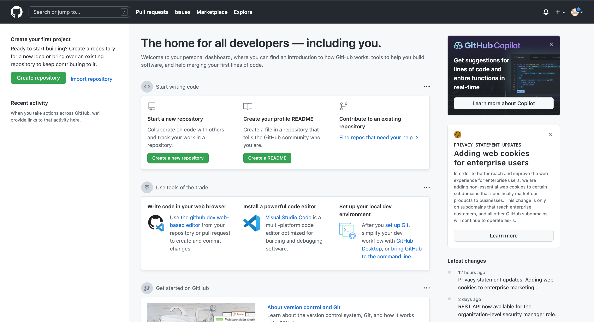
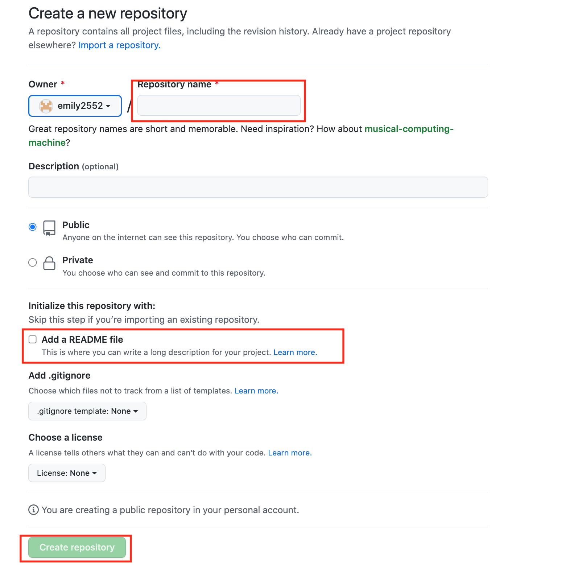
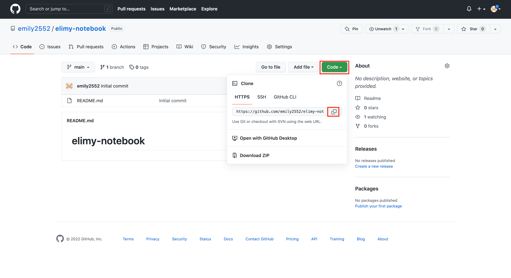
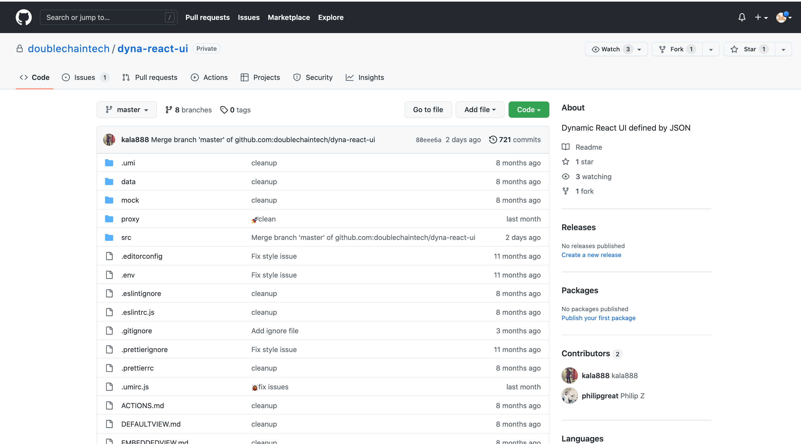

## 前端开发 ##

**准备工作**

1. git的账号创建。

**在git里创建一个repository**

1. 当你进入成功创建Git账号并进入后, 点击左上角的**Create repository**创建一个repositoty

2. 跳转到另一个新的界面  
    + 先给新建的repository起一个名字 （例如elimy-notebook） 
    + 记得点击*Add a README file*  
    + 最后点击绿色按键 *Create repository*    
    
  

**在Terminal里打开**

1. 粘贴并进入
    点击绿色按键*Code*之后会弹出一个新的小窗口，点击复制键（如红色框所圈） 
    

2. 打开Terminal
    + 输入`githome`以进入该目录
    + 输入`git clone ` + `https://github.com/emily2552/elimy-notebook.git`（第1点复制的内容），再按回车键  

3. 在网页上打开https://github.com/doublechaintech/dyna-react-ui/invitations 
    + 先点击*fork*把repository复制到自己的电脑里  
    + 再复制这个命令行（操作与第一点相同）

4. 回到Terminal
    + 输入`cd https://github.com/emily2552/dyna-re`   
    + 输入`git clone`+` https://github.com/emily2552/dyna-react-ui.git`(即+第3点复制的内容)
    + 输入`cd dyna-react-ui`
    + 输入`brew install node`，该过程完成的时间比较长，请耐心等待
    + 输入`yarn`， 该过程完成的时间比较长，请耐心等待
    

5. 在Terminal里再创建一个新的窗口
    + 输入
    
https://github.com/doublechaintech/dyna-react-ui/invitations