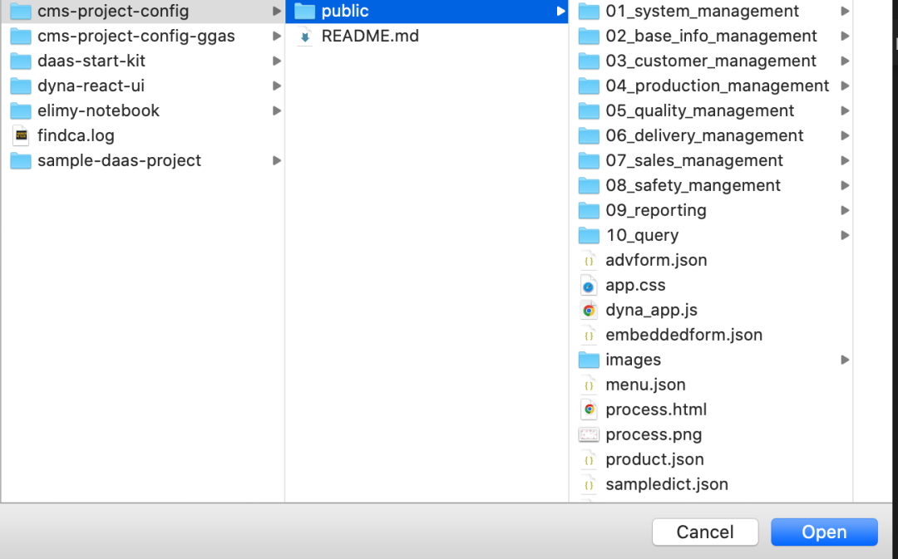
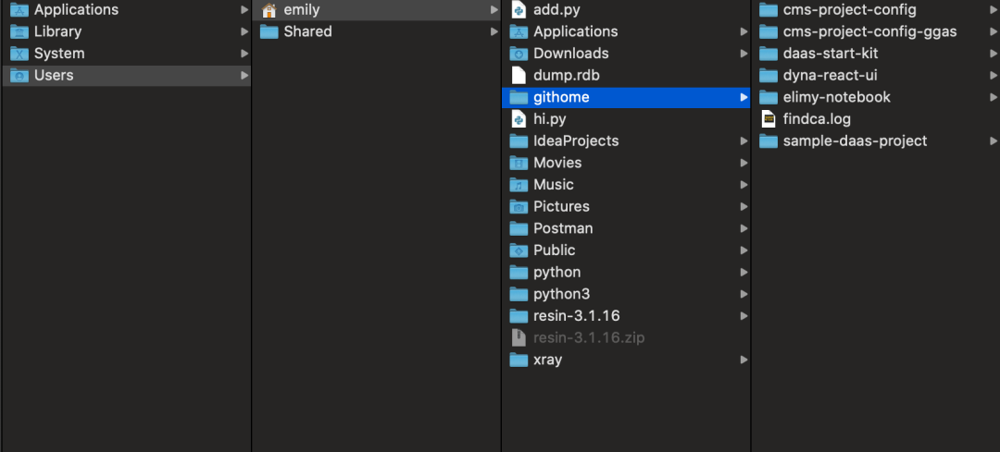
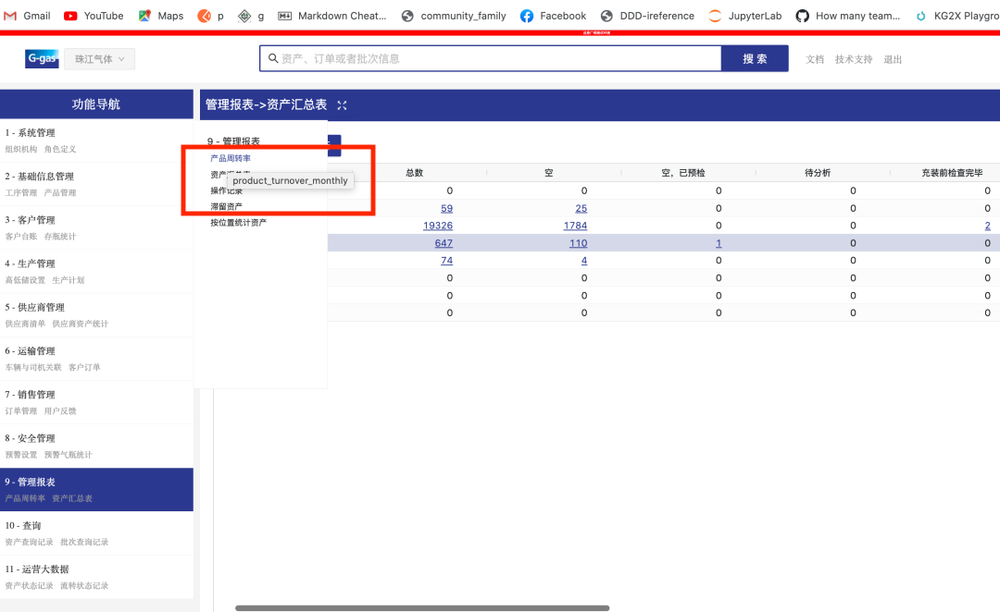
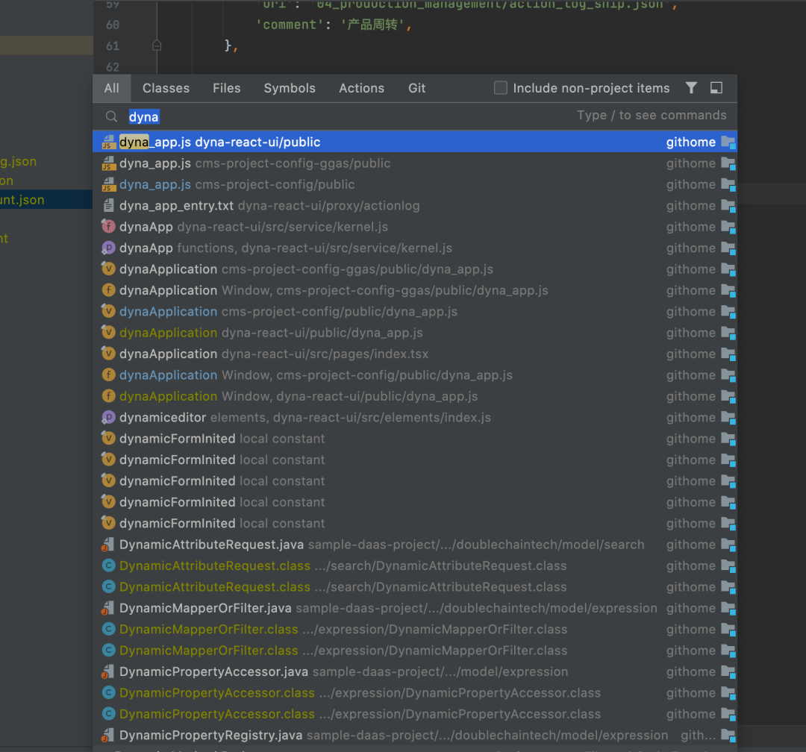
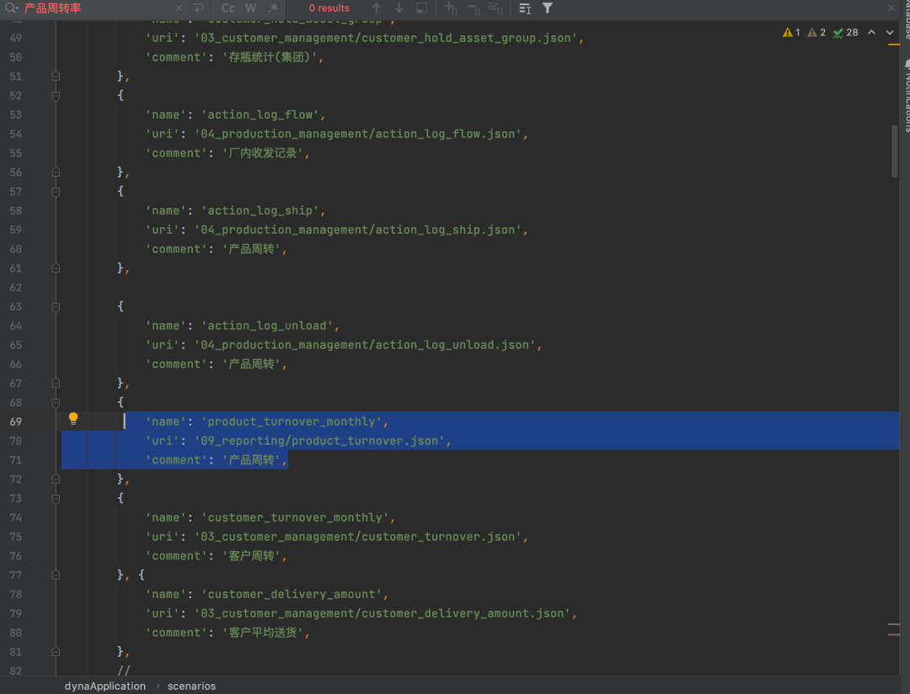
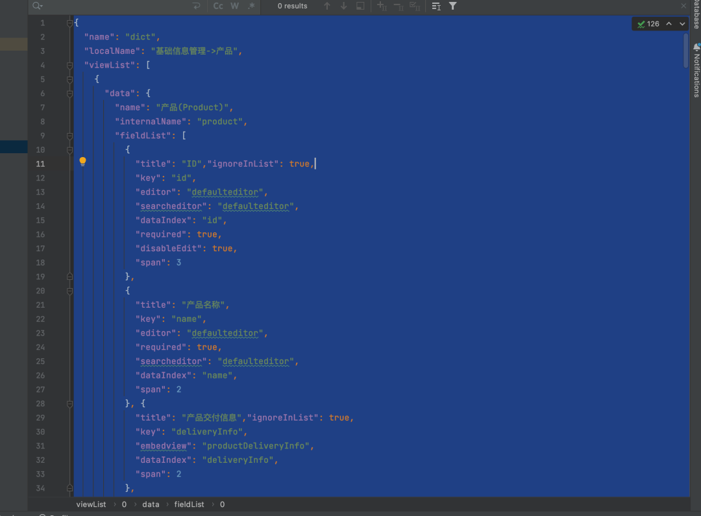
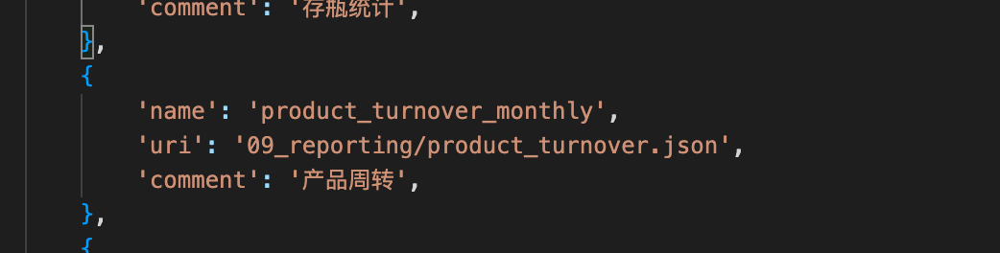
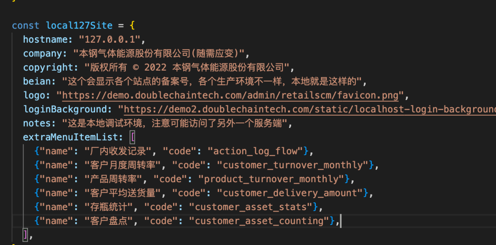

# 前端开发 #

进入https://github.com/ 创建git的账号

## 在git里创建一个repository ##

1. 进入git并创建一个账号，当你进入成功创建Git账号并进入后, 点击左上角的**Create repository**创建一个repositoty

2. 跳转到另一个新的界面  
    + 先给新建的repository起一个名字 （例如elimy-notebook） 
    + 记得点击*Add a README file*  
    + 最后点击绿色按键 *Create repository*    
    
  

## 在Terminal里打开 ## 

1. 粘贴并进入
    点击绿色按键*Code*之后会弹出一个新的小窗口，点击复制键（如红色框所圈） 
    

2. 打开Terminal
    + 输入`githome`以进入该目录
    + 输入`git clone ` + `https://github.com/emily2552/elimy-notebook.git`（第1点复制的内容），再按回车键  

3. 在网页上打开https://github.com/doublechaintech/dyna-react-ui/invitations 
    + 先点击*fork*把repository复制到自己的电脑里  
    + 再复制这个命令行（操作与第一点相同）

4. 回到Terminal
    + 输入`cd https://github.com/emily2552/dyna-re`   
    + 输入`git clone`+` https://github.com/emily2552/dyna-react-ui.git`(即+第3点复制的内容)
    + 输入`cd dyna-react-ui`
    + 输入`brew install node`，该过程完成的时间比较长，请耐心等待
    + 输入`npm install --global yarn`
    + 输入`yarn`该过程完成的时间比较长，请耐心等待
    

5. 在网页上打开https://github.com/emily2552/cms-project-config
    点击fork

6. 在Terminal里再创建一个新的窗口，联接文件public
    + 输入`githome`以进入该目录
    + 输入`git clone https://github.com/emily2552/cms-project-config.git`
    + 输入`cd cms-project-config `
    + 输入`git branch`
        如果显示的内容只有master（如下图所示），那么是在第5步的时候没有取消掉**fork master only**
        这时需要吧第五步fork的内容删除，再来一次并取消掉**fork master only**
    + 输入`git remote -v`
    + 输入`git branch -a`    
    + 输入`https_proxy=http://127.0.0.1:1087 git pull`        
    + 输入`git checkout saas`  
    + 输入`cd ..`退回到上一目录
    + 输入`cd dyna-react-ui`  
    + 输入`ln`联接文件  
    + 输入`ln -s ~/githome/cms-project-config/public public`联接文件public
    
    
   
   
# 统一两个前端分支 #

 1. 在VScode里打开本地的文件
     
     
 2. 在IntelliJ IDEA打开相同的文件cms-project-config  
     
 

特别说明：  
+ VScode对应SaaS分支： 
    http://127.0.0.1:8000/

+ IntelliJ IDEA对应ggas分支： 
    https://cmstest.ggas.com/#
    
例如说：在SaaS分支（显示的网页里）没有“产品周转率”，而G-gas分支上有“产品周转率”，现在进行迁移，请遵循以下步骤。  

1. 在G-gas网页上，将鼠标光标放在“产品周转率”上，会自动显示名字
    

2. 再到IntelliJ IDEA里在public目录中打开dyna_app.js dyna-react-ui或者直接搜索（如下图所示）  
    
    
3. 在dyna_app.js dyna-react-ui文件里找到“产品周转率”，得知其所在目录09,以及文件名pproduct_turnover.json  
    
 
4. 在IntelliJ IDEA里打开这个文件，然后粘贴所有的内容  
    
    
5. 在Vscode里找到09的文件目录，在该目录下新建一个文件，粘贴刚才复制的内容并保存,在Vscode里打开dyna_app.js，添加上“产品周转”  
     
    
6. 在Vscode里打开siteinfo.js,进行登记（注意找对位置）  
    

