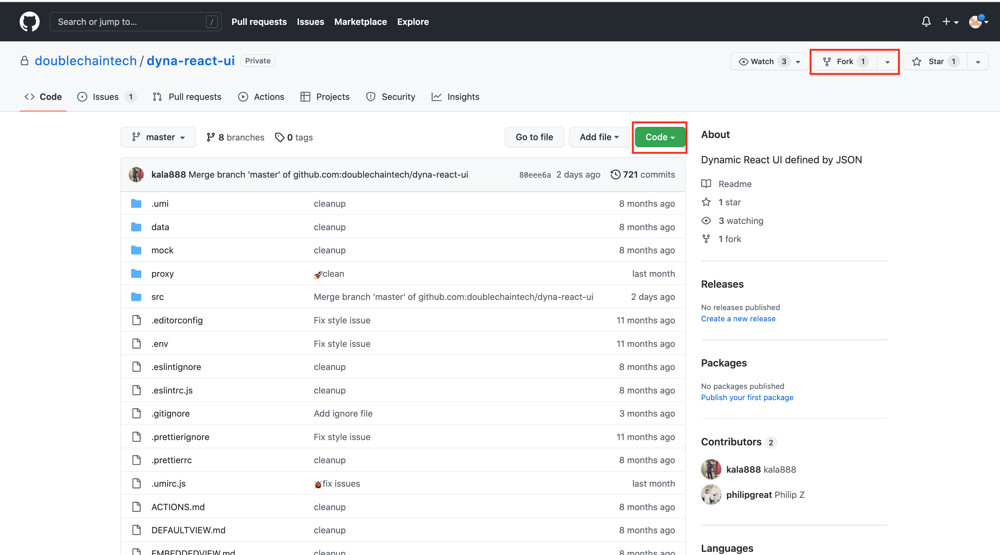

## 前端开发 ##

**准备工作**

1. git的账号创建。

**在git里创建一个repository**

1. 当你进入成功创建Git账号并进入后, 点击左上角的**Create repository**创建一个repositoty

2. 跳转到另一个新的界面  
    + 先给新建的repository起一个名字 （例如elimy-notebook） 
    + 记得点击*Add a README file* 绿色按键 
    + 最后点击Create repository  绿色按键   
    

**在Terminal里打开**

1. 粘贴并进入
    点击*Code* 绿色按键之后会弹出一个新的小窗口点击复制键（如红色框所圈） 
    

2. 打开Terminal
    + 输入`githome`以进入该目录
    + 输入git clone +空格+ 刚才粘贴的内容，再按回车键  

在网页上打开https://github.com/doublechaintech/dyna-react-ui/invitations   

    
    
   + 输入`cd https://github.com/emily2552/dyna-re`   
   + 输入`git clone https://github.com/emily2552/dyna-react-ui.git`
   + 输入`cd dyna-react-ui`
   + 输入`brew install node`， 该过程的时间花费得比较长，请耐心等待
   + 输入`yarn`
    
    
https://github.com/doublechaintech/dyna-react-ui/invitations