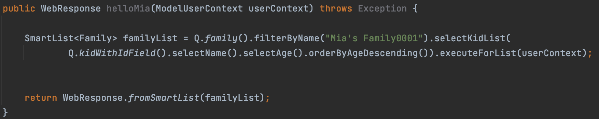
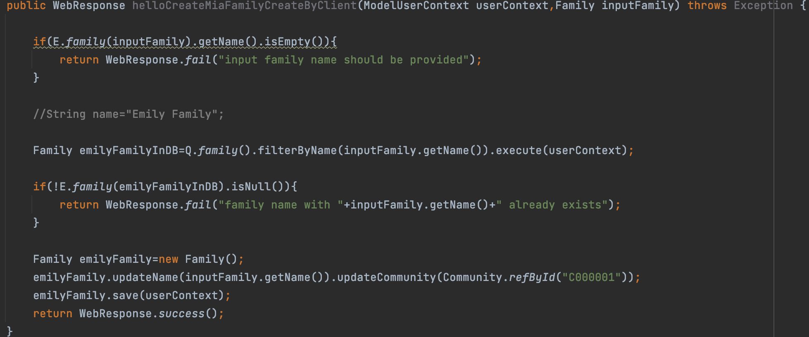
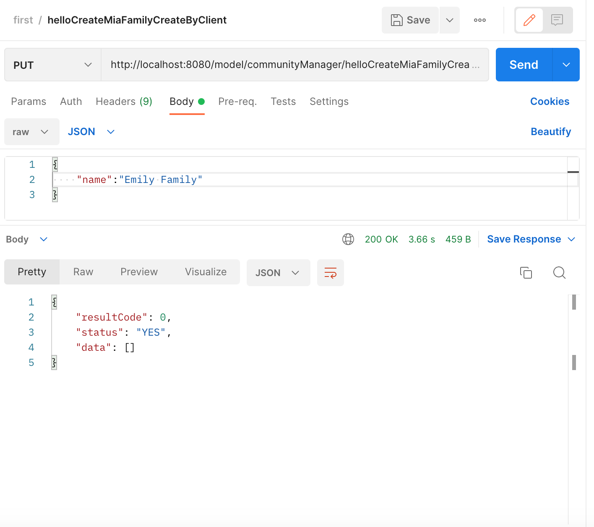
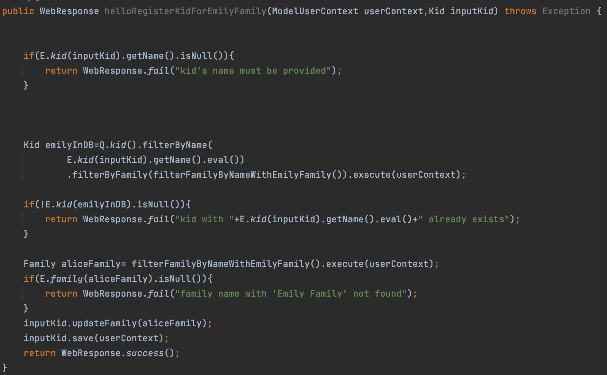
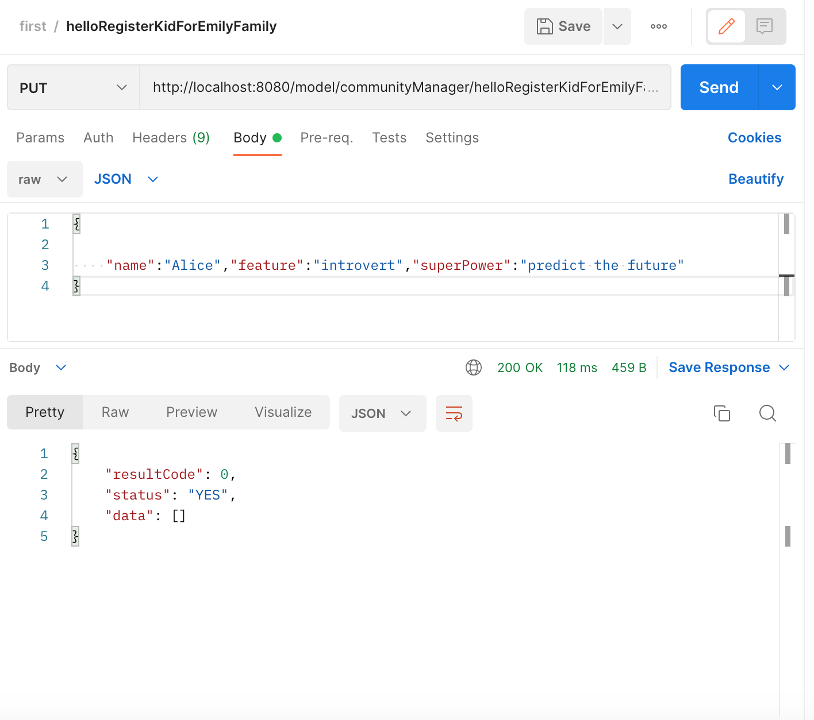
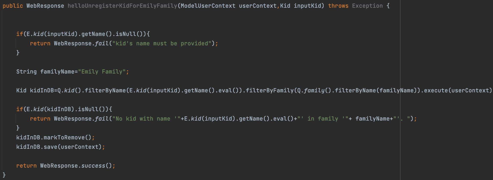
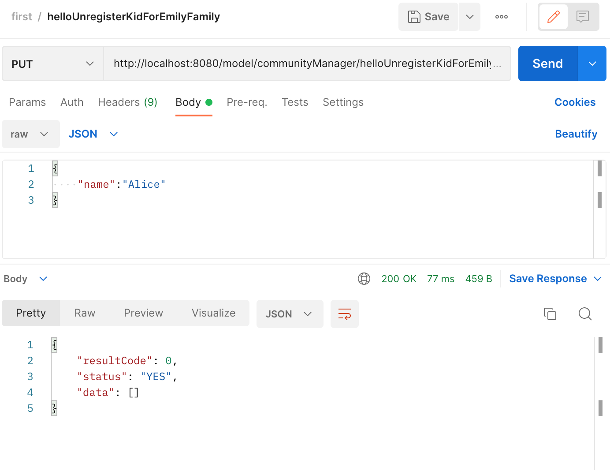
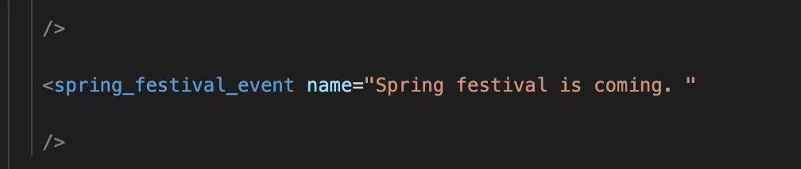
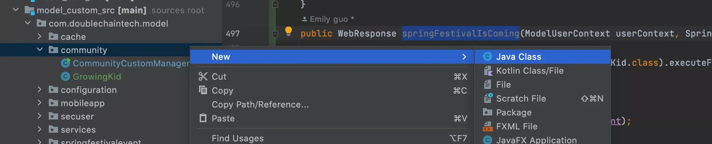

## WRITING FORMAT ##

Dear users, there is a writing format in IntlliJ IDEA. If you have learnt about Java,  
it's a piece of a cake for you.  

But if not, just follow the regulation below. 

1. Think about what information you want to see.  

    eg. you want to query kids list of Mia's family. 

2. write down the function. 

    eg. Take the scenario mentioned in the first point as an example， you can write the function like this.  
    
    

**Precautions**
    
1. *CamelCase*

    When you name a variable, if there are more than two words, the first letter of the first word is lowercase, and the first letter of the following words is uppercase.  
    
    eg. `helloMia` and `familyList` in the picture above followed the CamelCase.  
      
2. *necessary format*  
    
    + Starts with `public Webresponse` and ends with `return`. 
    + Mark each sentence with a semicolon. 
    + As for `SmartList<Family>`, when you write down the variable of familyList, IntelliJ IDEA will prompt you and fill it in automatically for you.  
    

3. *consistent*  

    eg. If you create a variable that named familyList, you must use `Q.family()`. 
    If you create a variable that named kidList, you must use`Q.kid()`. 
    

4. *!*
    
    It represents **not**
    
    
    
5. *E*
    
    It represent **expression**

6. *JSON's garammar*
    
    When you use Postman and the method you select is **PUT**, you need to use JSON,and its format is below.  
    `{"name":"something"}`
    
         
    
    
    
    
    
    
    
### CREATING A FAMILY ###

If you'd like to add a family to your current community, use the Postman.  
Here are the steps.  

1. open your postman and create a workspace first, and click **New** to create a collection. 
    then Add a new request in this collection. 

2. write a function for creating a family in IntelliJ IDEA. 
    
   The format is like this.
   
   
3. copy link, and open it in Postman. 
    select method **PUT**, then select **Body**, next select **JSON**. 
    After those steps, you can put the family you want to add by writing its name in this box. 
    
    
    When you complete this, click **Send**. It will return a message in **Body** like the picture above. That means you succeed to add a family. 
    
    
    
    
### REGISTERING A KID FOR A FAMILY ###

When a new family is created, it is empty. So we need register some kids and parents to this family.  
follow the steps below.  

1. write a function for registering kid for a family in IntelliJ IDEA.  
    The format is like this.  
    

2. Open Postman,then add a new request. Similarly, select method **PUT**, and input the link into the box.  
    click **Body** and select JSON.  
    Input name of the kid you want to register. Just like this. 
    
    
3. If the response body is like the picture above, that means you succeed. 

 

    

### UNREGISTERING A KID FOR A FAMILY ###

If you want to unregister a kid, the steps is same as *REGISTERING A KID FOR A FAMILY*.    
follow the steps below.  

1. write a function for unregistering kid for a family in IntelliJ IDEA.  
    The format is like this.  
    

2. Open Postman,then add a new request. Similarly, select method **PUT**, and input the link into the box.  
    click **Body** and select JSON.  
    Input name of the kid you want to register. Just like this. 
    
    
3. If the response body is like the picture above, that means you succeed. 

### NEW YEAR IS COMING ###

Presume a scene, New year is coming, so each kid in this community will grow one year older.  
in order to complete this **Transaction**, there is need to create a new calss.  
Details are as follows

1. Open the *model.xml*, add a line like this. 
    

2. Open your IntelliJ IDEA,and create a new class. The path is as follows.  
    /Users/yourname/githome/sample-daas-project/bizcore/WEB-INF/model_custom_src/com/doublechaintech/model/community/  
    Next, create a new calsses like this. 
    
    Then, write function in the new class as the picture below. 
    !

