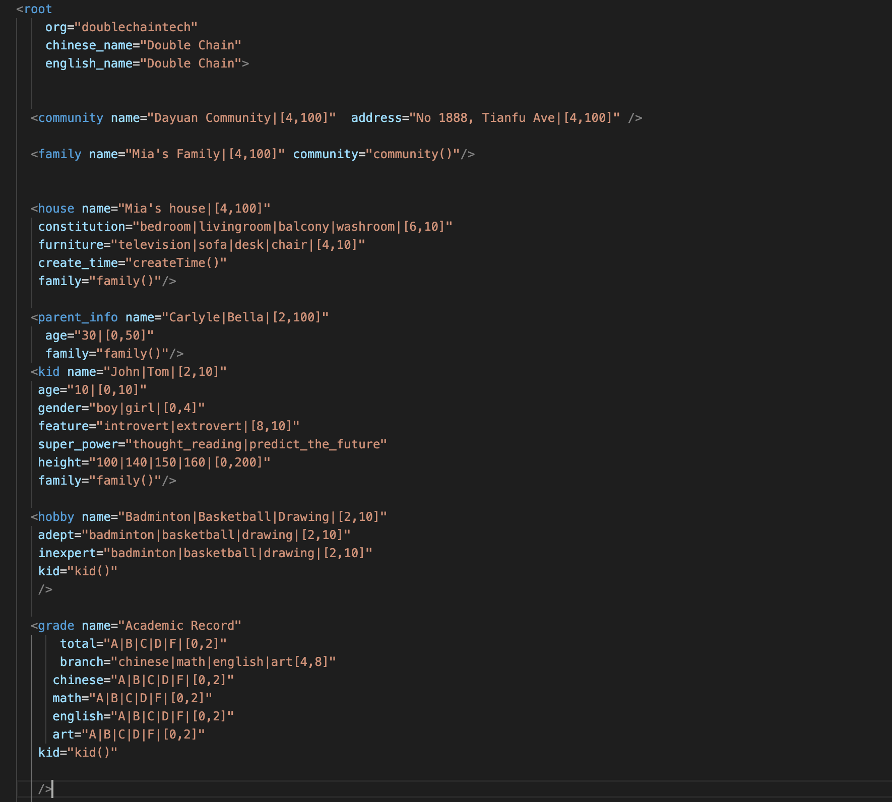

## MODEL PATTEN ##

Dear user, you can create a system model like this.  

There is a example below. 

this is a system of a community, 

Write them down according to the inclusion relationship, but after each object is created, it must be marked to which object it belongs.  

For example, the family belongs to the community. At the end of the family list, add `community="community()`.  and so on

Another note is to add  before and after every time you create one. 