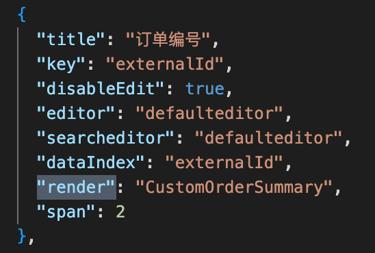
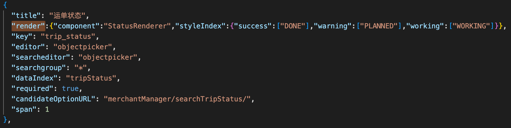
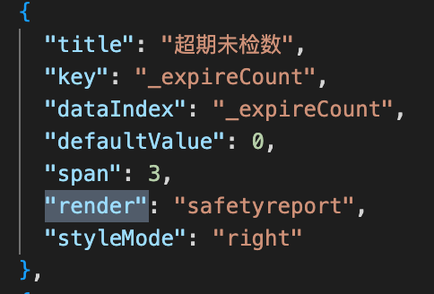
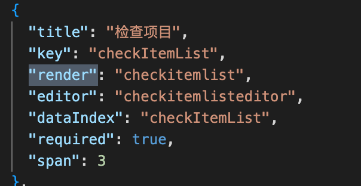

## render type #

1. **"actionsrender"**  
```json
{
            "title": "操作",
            "key": "name",
            "dataIndex": "actions",
            "render": "actionsrender"
}

```

2. **"actionlist"**  
```json
{
                "title": "操作",
                "key": "actions",
                "dataIndex": "actionList",
                "span": 0,
                "render": "actionlist"
}
```

3. **"datetimerender"**  


4. **"role"** 


5. 
6. **"assetactionlog"**  


7. **"productgroup"**  


8. **"yearmonthrender"** 


9. **"BooleanRendererCheckbox"**  


10.  {
                "component": "JumpToSubList",
                "target": "product-stats",
                "presetSearchData": {
                  "location": {
                    "id": "${id}"
                  }

                  

11. **"cylindermorelink"** 

12. **"NumberRenderer"**  


13. **"ScanCountRenderer"**  


15. **"CustomOrderSummary".**  



16. {"component":"StatusRenderer","styleIndex":{"success":["DONE"],"warning":["PLANNED"],"working":["WORKING"]}},


17. **"safetyreport"**  


18. **"checkitemlist"**  


