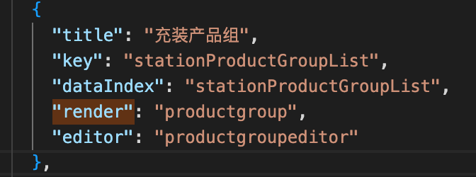
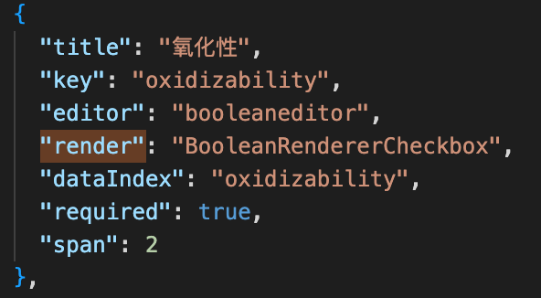
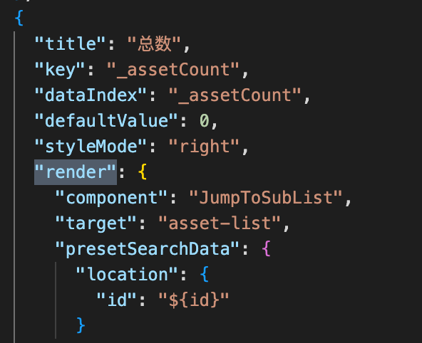
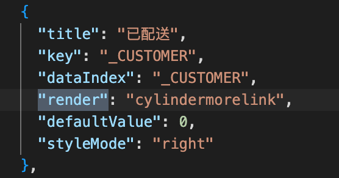

## render type #

1. "actionsrender".  

2. "actionlist".  

3. "datetimerender".  

4. "role".  

5. {"component":"JsonRenderer","format":"订单号: ${externalOrderId}","titleFormat":"行程代码${trip}/${externalOrderId}"},  

6. "assetactionlog".  

7. "productgroup".  

8. "yearmonthrender". 

9. "BooleanRendererCheckbox".  

10.  {
                "component": "JumpToSubList",
                "target": "product-stats",
                "presetSearchData": {
                  "location": {
                    "id": "${id}"
                  }

                  

11. "cylindermorelink". 

12. "NumberRenderer".  

13. "ScanCountRenderer".  

14. "analysisitemlist"

15. "CustomOrderSummary".  

16. "ScanCountRenderer".  

17. "CustomOrderSummary".  

18. {"component":"StatusRenderer","styleIndex":{"success":["DONE"],"warning":["PLANNED"],"working":["WORKING"]}},

19. "safetyreport".  

20. "checkitemlist".  

