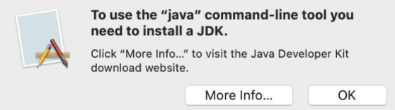

## daas setup

**after inputing,press return\enter**
1. input `mkdir githome' to create a foder. 
2. input `cd githome/ to enter it. 
3. input `git clone https://github.com/doublechaintech/daas-start-kit.git`. 
4. input `cd daas-start-kit/ to enter`. 
5. input `ls` to check if the file is existing. 
## 
**Get a large piece of sourece code**
1. input `cd githome`. 

2. input `git clone https://github.com/teaql/sample-daas-project.git’`. 

3. input `cd sample-daas-project`. 
4. input `ls` to look over the directory. then,we try to open one. 

5. input `bash update-code-from-model.sh’`.

in this step,you may meet this problem:your computer pops a message that says JDK haven't been installed.

Let's solve it by this way:input `brew install java` in Terminal, and wait for a while to install. when it finished, input` echo 'export PATH="/usr/local/opt/openjdk/bin:$PATH" >>  /Users/emily/.bash_profile`. Don't worry Terminal will give you this hint. 

7. input `java` to check if it has completed the installation. Of course, you can omit this step. 

8. if you encounter the problem in 5, input `bash update-code-from-model.sh` again after you complete the installation. 

9. After you have finished the step. 8 or step. 5,you will get a large piece of source code. That means you have suceed. 

