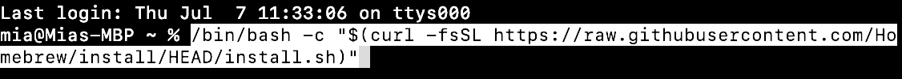
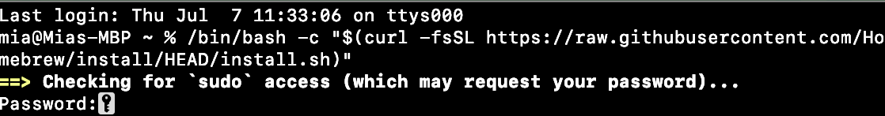
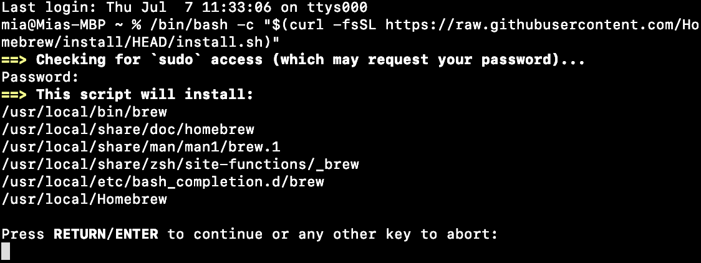

# homebrew setup

Hello, dear users. Welcome to read our setup guidance. Follow these steps and succeed to setup homebrew.

**First and foremost, make sure that you have owned a MAC.**

## Steps

1. Open a software that supports to enter command lines.
 
2. Input the command line:
！
`/bin/bash -c "$(curl -fsSL https://raw.githubusercontent.com/Homebrew/install/HEAD/install.sh)"`

 
 
3. Press enter.

4. Input your MAC password. It means you should enter what you input when you log in your MAC.

P.S. What you input in this step won't appear, so take it easy.

 
 
5. Press enter/return.

 
 
6. Wait patiently for setup complete.

---

A Text from Mia Kagura
