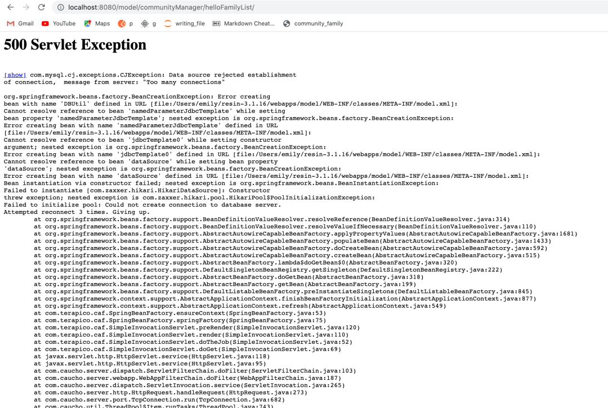
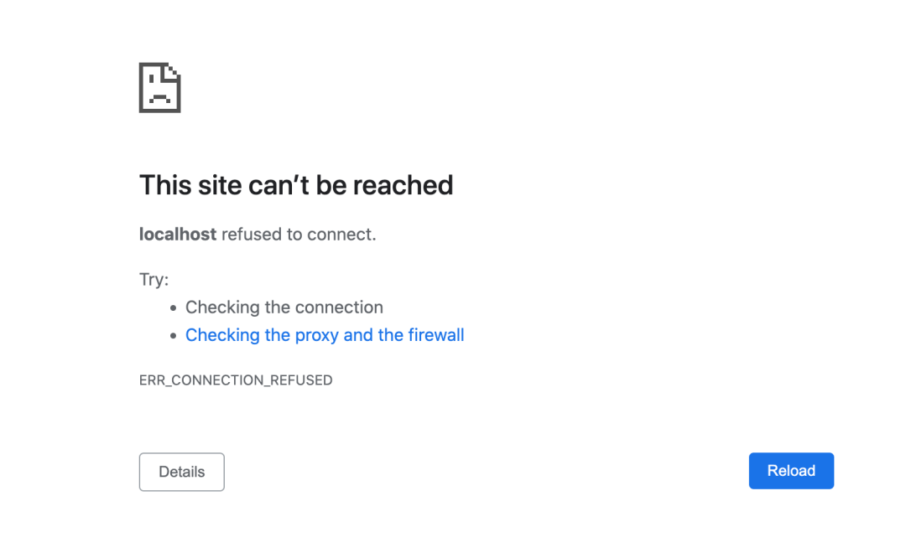

## CONNECTION TIME OUT ERROR ##

When you use Teaql for too long time, there could be an error when you open a website.  
The error image is shown below. 

**solution**  
Press Cntrol+C in your Terminal, then input `bin/httpd.sh`  

Return to the Website, update the page, and you will find you can visit it sucessfully.  

## CANNOT OPEN WEB PAGE ##

This error‘s image is as followed.  

**solution**

input `allowPublicKeyRetrieval TRUE` in your Terminal.  
（I have forgotten that it is in which folder. ） 

## ACCIDENTALLY CHANGED THE SOURCE CODE ##

When you use IntelliJ IDEA, it will give you hints. Errors in writing are displayed with a   
cursor. You can put your mouse cursor on red part, then it will show the method to solve it.  
Just click it, the problems will be sol

