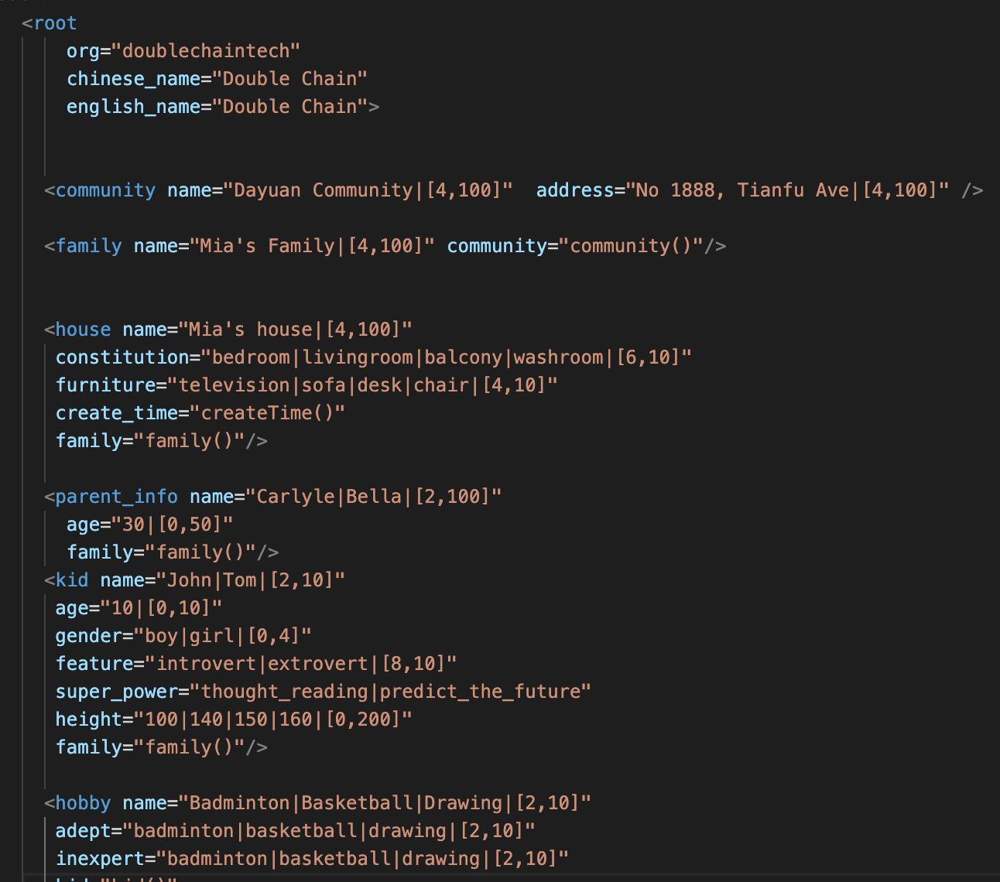
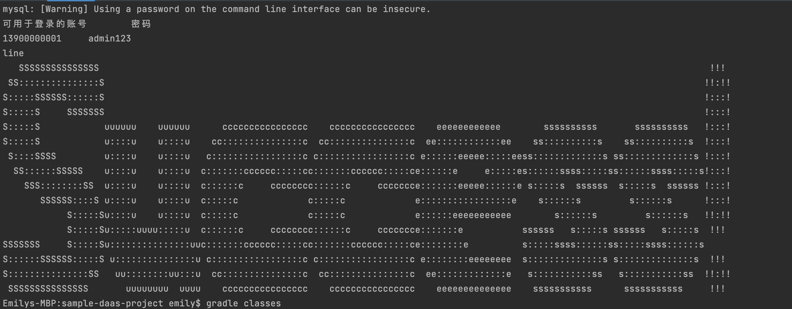
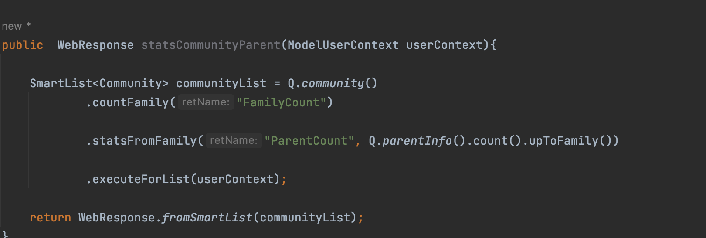

## MODEL ##
Create a model of a system in Vscode.  

the format of model is as follow.  

Once you've written the model, press Command+S for saving it.  

Then,input `cd ..` to exit folder *bizcore*. Nextly, input bash update`bash update-code-from-model.sh ` in folder and wait for a while. 

If you succeed, the Terminal will show you this  

## QUERRY WEB RESPONSE ##

Write fuctions by IntelliJ IDEA.  
eg.
  
Input `gradle classes`. 

Enter http://localhost:8080/model/ with name that you chose+`/`.  

